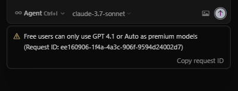

# Cursor-pro

突破claude-3.7的限制。（注意把自己的提示词先备份好）
# 注意
当还是不行时，一定要换ip，可能是ip污染（已经有少部分人出现这种情况了）多试几次

## 解决问题

## 功能

* 删除 `globalStorage/state.vscdb` 和 `globalStorage/state.vscdb.backup` 文件
* 清空 `History` 文件夹内的所有内容
* 删除 `workspaceStorage` 文件夹及其内容

## 使用演示

下面是工具使用演示视频：

[点击下载观看视频](20250530_005756.mp4)

<video width="640" height="360" controls>
  <source src="20250530_005756.mp4" type="video/mp4">
  您的浏览器不支持视频标签
</video>


### Windows系统

#### 使用打包后的exe文件

1. 右键点击打包后的exe文件，选择"以管理员身份运行"

### Mac系统

#### 使用Python脚本

1. 打开终端(Terminal)
2. 进入脚本所在目录
3. 执行以下命令运行脚本:
```
sudo python3 cursor_clean_mac.py
```

#### 使用打包后的可执行文件

1. 打开终端(Terminal)
2. 进入可执行文件所在目录
3. 执行以下命令运行:
```
sudo ./cursor_clean_mac
```

注意：在Mac系统中程序需要管理员权限才能运行，因为需要访问系统受保护的文件。

## 配置文件

### Windows系统

脚本会自动创建 `config.env` 配置文件，您可以根据需要修改其中的路径设置：

```ini
[PATHS]
# Cursor用户数据目录路径
base_path = C:\Users\用户名\AppData\Roaming\Cursor\User
```
exe文件会在dist文件夹中，配置文件需要和exe放在同一目录。

### Mac系统

程序会自动创建 `config_mac.env` 配置文件，您可以根据需要修改其中的路径设置：

```ini
[PATHS]
# Cursor用户数据目录路径
base_path = ~/Library/Application Support/Cursor/User
```

配置文件需要和脚本或可执行文件放在同一目录。

# 问题反馈群（拉你进群）

